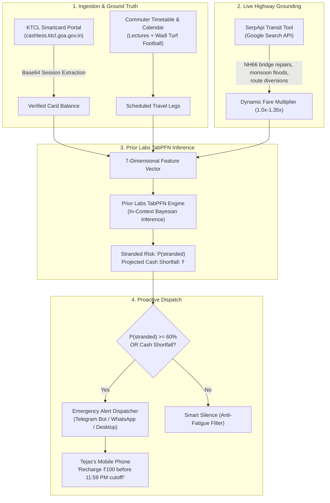

# 🛡️ KTCL CommuteShield — Open-Source AI Bus Card Exhaustion & Stranded Risk Forecaster

<div align="center">


[](https://www.python.org/)
[](https://pytest.org/)
[](https://github.com/prior-labs/TabPFN)
[](https://serpapi.com/)
[](https://youtu.be/D4Vc1PeqGnk)
[](LICENSE)

**An autonomous, privacy-preserving transit safety agent pairing Prior Labs TabPFN Bayesian tabular foundation models with SerpApi real-time Google Search transit intelligence to prevent college students from getting stranded at bus turnstiles.**

[📺 Video Demo](https://youtu.be/D4Vc1PeqGnk) • [🚀 Quickstart](#-quickstart) • [📐 Architecture](#-system-architecture) • [📊 TabPFN Foundation Model](#-prior-labs-tabpfn-foundation-model) • [🔍 SerpApi Grounding](#-serpapi-live-transit-grounding) • [🧪 Testing](#-testing--verification)

</div>

---

## 📖 The Human Story & Problem

### Built for a Friend: Tejas
Tejas is an engineering classmate in Goa who commutes daily between **Margao** and our engineering campus at **Farmagudi**. Like thousands of students across Goa, he relies on a **Kadamba Transport Corporation Ltd (KTCL)** RFID smart card to tap through depot turnstiles and board the college transit bus.

### The Hidden Trap: Offline Depot Batch Synchronization (11:59 PM IST Cutoff)
1. **Offline Handheld Terminals**: KTCL buses and depot turnstiles use offline electronic ticketing machines (ETMs) that reconcile with the central bank database only once every 24 hours.
2. **Strict 11:59 PM IST Deadline**: The central database closes its overnight batch sync queue at **11:59 PM IST**. 
3. **The Morning Rejection**: If a commuter recharges online at 12:05 AM, the funds leave their bank account, but the balance **fails to sync to the depot turnstiles until the following evening**. When Tejas taps his smart card at 7:30 AM at Margao depot, the turnstile buzzer sounds red, his card is declined, and the bus departs without him right before morning tests.

<div align="center">


</div>

### The Wadi Football Turf Detour
Tejas frequently plays evening football matches at **Wadi turf near Ponda** after late laboratory sessions. This adds unexpected bus legs (Margao $\to$ Farmagudi $\to$ Wadi Turf $\to$ Margao). On Friday evening, his balance drops to ₹18 without him realizing it. 

<div align="center">


</div>

### Why Simple Threshold Rules Fail
Naive alerts like *"alert whenever balance is below ₹50"* induce severe **notification fatigue**:
- On a light Tuesday with 1 lecture (fare needed: ₹17), ₹25 is completely safe. Naive alerts spam his phone unnecessarily.
- On a Friday with classes and evening football (fare needed: ₹70), ₹45 will strand him, yet a naive threshold fails to detect the danger.

### What Tejas Said
> *"The 11:59 PM depot cutoff stranded me twice last semester during monsoon examinations. CommuteShield pinged my Telegram at 8:15 PM on Friday warning me about the Wadi turf detour and gave me the exact recharge figure. That alert saved me from standing stranded at Margao depot at 7:30 AM."*

---

## 📺 Video Demonstration

Watch the complete technical walkthrough and multi-scenario demonstration on YouTube:

[](https://youtu.be/D4Vc1PeqGnk)

🔗 **YouTube Link**: [https://youtu.be/D4Vc1PeqGnk](https://youtu.be/D4Vc1PeqGnk)

---

## 📐 System Architecture

CommuteShield runs automatically every evening at **8:00 PM IST** (nearly 4 hours ahead of the depot sync cutoff).



---

## 📊 Prior Labs TabPFN Foundation Model

Personal transit ledgers suffer from small sample sizes ($N = 40$ to $80$ records). Traditional tree algorithms (XGBoost, Random Forests) and deep neural networks overfit or require tedious hyperparameter tuning.

**Prior Labs TabPFN solves this fundamentally.**

TabPFN is a foundation model pre-trained on millions of synthetic tabular datasets to perform **in-context Bayesian inference in a single forward pass**. It acts as a prior over structural tabular functions, requiring zero gradient descent steps, zero training epochs, and zero hyperparameter tuning.

Running locally on consumer hardware, TabPFN evaluates 7 calibrated transit features:
1. `day_of_week`: Day index (Monday–Saturday schedule patterns)
2. `current_balance`: Live scraped or recorded card balance in INR
3. `scheduled_trips`: Daily class count (lectures + laboratory sessions)
4. `turf_match`: Boolean indicator for evening Wadi turf football
5. `days_since_recharge`: Elapsed days since last monetary top-up
6. `disruption_multiplier`: Real-time highway disruption factor from SerpApi (1.0x–1.35x)
7. `daily_burn`: Exponential moving average of daily transit expenditure

---

## 🔍 SerpApi Live Transit Grounding

Goa bus corridors regularly encounter seasonal monsoon flooding, Zuari bridge congestion, and NH66 road work. CommuteShield uses **SerpApi** to query Google Search for real-time transit bulletins across Kadamba routes and Goa traffic advisories. 

When road disruptions or flood diversions are detected, SerpApi elevates the fare multiplier from 1.0x to 1.35x, feeding the real-time cost directly into TabPFN's Bayesian inference vector.

<div align="center">


</div>

---

## 🔒 Privacy & Local Edge Sovereignty

1. **Student Location Sovereignty**: Daily commute logs document intimate personal habits (home address, campus timetable, evening sports locations, timestamps). Passing student travel records to commercial cloud LLMs violates student privacy. Open-weight TabPFN runs **100% locally on Tejas's laptop**, ensuring sensitive movement patterns never leave the machine.
2. **Zero Marginal Operating Cost**: The entire inference stack runs on standard consumer CPU hardware in under 200ms. Students operate CommuteShield indefinitely without paying recurring cloud token fees.
3. **Resilient Offline Execution**: During monsoon weather when internet connectivity drops, CommuteShield evaluates risk offline using local model weights and local timetable records.

<div align="center">


</div>

---

## 🚀 Quickstart

### 1. Clone & Set Up Environment

```bash
git clone https://github.com/Labreo/KTCL-CommuteShield.git
cd KTCL-CommuteShield

# Create virtual environment
python3 -m venv .venv
source .venv/bin/activate

# Install dependencies
pip install -r requirements.txt
```

### 2. Configure Environment Variables

```bash
cp .env.example .env
```

Edit `.env` with your keys (optional for simulation/fallback):
```env
# Optional: SerpApi key for real-time Google Search transit grounding
SERPAPI_API_KEY=your_serpapi_key_here

# Optional: Telegram Bot credentials for real-time mobile alerts
TELEGRAM_BOT_TOKEN=your_bot_token_here
TELEGRAM_CHAT_ID=your_chat_id_here
```

### 3. Run CommuteShield

#### Live Assessment (Safe Commute / Smart Silence):
```bash
python cli.py run
```

#### Friday Football Trap (Critical Risk & Emergency Alert):
```bash
python cli.py run --balance 18.0 --turf 1
```

<div align="center">


</div>

#### Inspect Real-Time SerpApi Highway Grounding:
```bash
python cli.py transit
```

#### Run Multi-Scenario Validation Suite:
```bash
python cli.py simulate
```

---

## 🧪 Testing & Verification

CommuteShield includes a comprehensive 14-test pytest suite validating agent decision logic, TabPFN initialization, SerpApi transit fallbacks, and privacy-preserving card masking:

```bash
pytest -v
```

```text
============================= test session starts ==============================
collected 14 items

tests/test_agent.py::test_agent_assessment_safe PASSED                   [  7%]
tests/test_agent.py::test_agent_assessment_stranded_risk PASSED          [ 14%]
tests/test_config.py::test_card_masking PASSED                           [ 21%]
tests/test_config.py::test_config_defaults PASSED                        [ 28%]
tests/test_config.py::test_masked_summary_does_not_leak_full_card PASSED [ 35%]
tests/test_model.py::test_tabpfn_engine_initialization PASSED            [ 42%]
tests/test_model.py::test_tabpfn_predict_safe_commute PASSED             [ 50%]
tests/test_model.py::test_tabpfn_predict_critical_commute PASSED         [ 57%]
tests/test_scraper.py::test_scraper_token_encoding PASSED                [ 64%]
tests/test_scraper.py::test_scraper_simulated_balance PASSED             [ 71%]
tests/test_scraper.py::test_scraper_fallback_on_unreachable PASSED       [ 78%]
tests/test_serpapi.py::test_transit_intelligence_regional_fallback PASSED [ 85%]
tests/test_serpapi.py::test_transit_intelligence_live_with_env_key PASSED [ 92%]
tests/test_serpapi.py::test_transit_intelligence_keyword_detection PASSED [100%]

============================= 14 passed in 17.27s ==============================
```

---

## 📂 Project Structure

```text
KTCL-CommuteShield/
├── cli.py                     # Interactive Rich terminal CLI
├── commuteshield/
│   ├── tabpfn_model.py        # Prior Labs TabPFN Bayesian tabular inference engine
│   ├── serpapi_tool.py        # SerpApi real-time Google Search transit grounding
│   ├── scraper.py             # Authenticated, masked KTCL portal balance scraper
│   ├── agent.py               # CommuteShield orchestrator & decision logic
│   ├── notifier.py            # Telegram, Twilio WhatsApp, & desktop dispatchers
│   ├── config.py              # Configuration & privacy-preserving masking
│   └── data/
│       └── friend_commute_history.csv  # 60-day commuter transit training ledger
├── tests/                     # 14-test pytest validation suite
├── assets/                    # Architectural diagrams, title card, and UI screenshots
├── pyproject.toml             # Python 3.12 project metadata
└── requirements.txt           # Production dependencies
```

---

## 📜 Credits & Acknowledgments

- **Prior Labs**: For [TabPFN](https://github.com/prior-labs/TabPFN), the pioneering tabular foundation model making Bayesian inference accessible on consumer hardware.
- **SerpApi**: For real-time Google Search API infrastructure powering our transit intelligence grounding.
- **Kadamba Transport Corporation Ltd (KTCL)**: For public transit services across Goa.
- **DEV Community & MLH**: For organizing the [Hacktoberfest Weekend Challenge: Build for a Friend](https://dev.to/challenges/hacktoberfest-weekend-2026-10-01).

---

<div align="center">
Built with ❤️ in Goa, India for my friend Tejas.
</div>
