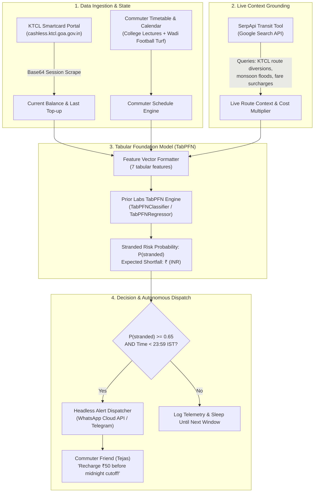

# KTCL CommuteShield — Open-Source AI Bus Card Exhaustion & Stranded Risk Forecaster

> **Hackathon**: [Hacktoberfest Weekend Challenge: Build for a Friend (HF26)](https://dev.to/challenges/hacktoberfest-weekend-2026-10-01)  
> **Challenge Tag**: [`dev.to/t/hf26challenge`](https://dev.to/t/hf26challenge)  
> **Target Prize Categories (0 Competitors)**:
> 1. 🏆 **Best Use of TabPFN (Featured — $200 USD)**
> 2. 🔍 **Best Use of SerpApi (Partner — $100 USD)**  
> **Author**: Kanak Sanjay Waradkar ([@Labreo](https://github.com/Labreo))  
> **Legacy Reference**: [`github.com/Labreo/KTCL-Balance-Checker`](https://github.com/Labreo/KTCL-Balance-Checker)  
> **Deliverable Plan**: Complete architectural blueprint, tabular ML pipeline, and submission roadmap.

---

## 1. Executive Summary & Core Philosophy

**KTCL CommuteShield** is an autonomous, privacy-preserving transit safety agent built for college friends commuting daily across Goa on **Kadamba Transport Corporation Ltd (KTCL)** buses. 

Unlike primitive balance checkers that rely on fragile hardcoded thresholds (e.g., `balance < ₹60`), CommuteShield pairs **Prior Labs' TabPFN tabular foundation model** with **SerpApi real-time transit intelligence** to calculate the calibrated probability of a commuter getting stranded before the next depot server sync window.



---

## 2. The Human Story & Friend Problem

### The Friend: Tejas & The Goa Commuter Circle
Tejas is a college friend and frequent football teammate who commutes daily across Goa to college (GEC Farmagudi / Margao hubs) relying on a prepaid **KTCL Smart Card**.

### The Real Problem: The "Midnight Depot Sync" Trap
1. **Batch-Settlement Legacy Architecture**: KTCL smart cards are contactless RFID cards processed by bus conductors on portable Electronic Ticket Machines (ETMs). These handheld ETMs operate offline on the buses and only sync with KTCL's central database at the bus depot at **midnight (11:59 PM IST)**.
2. **The Asymmetric Commute**: On normal days, a round trip costs ₹30–₹40. But on days with unplanned travel—such as traveling to **Wadi turf for football** (*"12 to 14 ppl, 4 log ka arranged hai... wadi book hua hai 15 to 20 mins drive"*) or staying back for lab exams—the card balance gets depleted late in the afternoon.
3. **The Stranded Event**: If Tejas reaches home with ₹18 on his card, he forgets about it. The next morning at **7:30 AM**, boarding the bus at the depot, the ETM buzzes red. The card is declined. Because rural Goa bus stops do not have top-up kiosks and conductors frequently refuse cash on smart card concession passes, students get turned away and miss morning lectures.
4. **Why a Hardcoded Threshold Fails**:
   - On Tuesday (only 1 lecture, ₹20 fare needed): ₹25 balance is safe. A naive `balance < 50` alert generates **notification fatigue** and gets ignored.
   - On Friday (college + Wadi football turf detour, ₹70 fare needed): ₹45 balance will **strand him**. A naive rule fails to trigger because ₹45 looks "fine".

---

## 3. Targeted Prize Categories (The Zero-Competition Edge)

Based on the [hackathons/hacktoberfest_weekend_2026_categories_tally.md](file:///Users/sanjaywaradkar/learning/hackathons/hacktoberfest_weekend_2026_categories_tally.md) analysis across all 54 active submissions, both targeted categories have **0 competitors**:

### 1. 🏆 Best Use of TabPFN (Featured Category — $200 USD)
* **Prompt**: *"Use TabPFN, Prior Labs' tabular foundation model, to forecast, predict, classify, or spot anomalies from historical data like a CSV. Use it inside an agent tool (with or without the MCP server) or on its own."*
* **Competition**: **0 Submissions (0% saturation)**.
* **Implementation**: We use Prior Labs' `tabpfn` Python library. TabPFN is a Transformer pre-trained on millions of synthetic tabular datasets that performs in-context Bayesian inference on tabular data in a single forward pass without iterative training or hyperparameter tuning. It handles small personal datasets ($N = 30$ to $100$ commute records) where XGBoost and Random Forests severely overfit.

### 2. 🔍 Best Use of SerpApi (Partner Category — $100 USD)
* **Prompt**: *"Ground your agent with live search data via SerpApi."*
* **Competition**: **0 Submissions (0% saturation)**.
* **Implementation**: Uses `google-search-results` (SerpApi Python SDK) to query real-time Goa transit bulletins:
  - NH66 highway construction diversions and bus re-routings.
  - Kadamba monsoon weather alerts and route cancelations.
  - Live festival/holiday schedules (e.g., Gandhi Jayanti, Diwali special shuttles).
  - Transit fare revisions.

---

## 4. Legacy Architecture vs. Modern CommuteShield

| Dimension | Legacy Script (`Labreo/KTCL-Balance-Checker`) | Modern CommuteShield (This Hackathon) |
|---|---|---|
| **Intelligence** | `if balance < 60:` (Hardcoded static condition) | **Prior Labs TabPFN** in-context tabular foundation model calculating calibrated $P(\text{stranded})$. |
| **Context** | Blind to calendar, weather, or extracurriculars | Ingests timetable, turf bookings, and **SerpApi** live transit updates. |
| **Notification** | Brittle `pywhatkit` + `pyautogui` keyboard/mouse hijacking (requires open desktop session) | Headless delivery via **WhatsApp Cloud API / Twilio Webhook / Telegram Bot**. |
| **Execution** | Manual interactive terminal prompt | Autonomous scheduled daemon running daily at 8:00 PM IST (before midnight cutoff). |
| **Telemetry & Privacy** | Local plain text prints | Local offline ML inference; zero mobility logs sent to commercial LLM servers. |

---

## 5. Technical Architecture & Component Breakdown

### 5.1 The TabPFN Inference Pipeline

```
Dataset: friend_commute_history.csv (~60 historical observations)
Features:
  1. day_of_week (int: 0=Mon, 4=Fri, 6=Sun)
  2. current_balance (float: INR from KTCL portal)
  3. scheduled_trips_count (int: lectures + labs + turf matches)
  4. turf_sports_flag (binary: 0 or 1, e.g. Wadi football)
  5. days_since_last_topup (int: elapsed days)
  6. serpapi_disruption_index (float: 1.0 = normal, 1.5 = detour fare hike)
  7. historical_daily_burn (float: moving average burn rate)
Target:
  - stranded_next_morning (binary: 0 = safe, 1 = declined at turnstile)
```

```python
from tabpfn import TabPFNClassifier
import numpy as np
import pandas as pd

# Zero-shot tabular inference without iterative gradient descent
classifier = TabPFNClassifier(device='cpu', N_ensemble_configurations=8)

# Historical commute ledger
X_train = df_history[FEATURE_COLS].values
y_train = df_history['stranded_event'].values

# Today's live snapshot at 8:00 PM IST
X_today = np.array([[day_of_week, current_balance, planned_trips, turf_flag, days_topup, disruption_idx, burn_rate]])

classifier.fit(X_train, y_train)
probabilities = classifier.predict_proba(X_today)
stranded_prob = probabilities[0][1] # Calibrated P(stranded)
```

### 5.2 The SerpApi Live Transit Tool

```python
from serpapi import GoogleSearch
import os

def check_goa_transit_disruptions(origin="Margao", destination="Farmagudi"):
    """Grounding tool checking real-time KTCL disruptions, fuel surcharges, and road diversions."""
    params = {
        "engine": "google",
        "q": f"KTCL Kadamba bus route updates {origin} to {destination} Goa weather disruption",
        "location": "Goa, India",
        "hl": "en",
        "gl": "in",
        "api_key": os.getenv("SERPAPI_API_KEY")
    }
    search = GoogleSearch(params)
    results = search.get_dict()
    
    # Parse organic results for active alerts
    snippets = [r.get("snippet", "") for r in results.get("organic_results", [])[:3]]
    disruption_multiplier = 1.0
    for snippet in snippets:
        if any(term in snippet.lower() for term in ["diverted", "strike", "monsoon", "shutdown", "fare hike"]):
            disruption_multiplier = 1.35
            break
            
    return disruption_multiplier, snippets
```

### 5.3 The Robust KTCL Portal Scraper

Modernizing the base64 endpoint discovery from the legacy project:
```python
import requests
from bs4 import BeautifulSoup
import base64

def fetch_ktcl_wallet_balance(card_number: str) -> float:
    base_url = "https://cashless.ktcl.goa.gov.in"
    encoded_card = base64.b64encode(f"{card_number}|test_value".encode()).decode()
    target_url = f"{base_url}/Smartcard/card_details/{encoded_card}"
    
    headers = {
        "User-Agent": "Mozilla/5.0 (Macintosh; Intel Mac OS X 10_15_7) AppleWebKit/537.36",
        "Referer": f"{base_url}/Smartcard/card_details/",
        "Origin": base_url
    }
    
    resp = requests.get(target_url, headers=headers, timeout=10)
    soup = BeautifulSoup(resp.text, "html.parser")
    wallet = soup.find("input", {"id": "Wallet_balance"})
    if wallet and wallet.get("value"):
        return float(wallet.get("value"))
    raise ValueError("Failed to retrieve balance from KTCL portal. Gateway timeout or invalid card ID.")
```

### 5.4 Headless Notification Dispatcher (WhatsApp / Telegram)

```python
def dispatch_alert(friend_name: str, balance: float, p_stranded: float, shortfall: float):
    message = (
        f"🚨 *KTCL CommuteShield Alert for {friend_name}*\n\n"
        f"💳 *Current Balance*: ₹{balance:.2f}\n"
        f"⚠️ *Stranded Risk Tomorrow*: {p_stranded * 100:.1f}%\n"
        f"📉 *Projected Shortfall*: ₹{shortfall:.2f}\n\n"
        f"ℹ️ *Why this alert?* You have college + football scheduled tomorrow. "
        f"KTCL depot servers close batch processing at **11:59 PM tonight**.\n\n"
        f"👉 *Action Required*: Top up at least ₹50 online before midnight to avoid being declined at the 7:30 AM depot turnstile!"
    )
    # Headless dispatch via Twilio API or Telegram Bot API
    send_telegram_notification(message)
```

---

## 6. Why Open Innovation Matters (The Core Hackathon Prompt)

1. **Location & Financial Data Sovereignty**: Commute records reveal exact daily movement (home address, college hours, turf locations, late-night stops). Commercial closed LLMs (e.g., sending commuter logs to OpenAI or Anthropic) violate student privacy and risk personal location tracking.
2. **Deterministic, Hallucination-Free Math**: Closed LLMs frequently hallucinate arithmetic, making them dangerous for balance and currency calculations. TabPFN is grounded mathematically in Bayesian prior distributions over tabular data, producing exact, reproducible calibrated probabilities.
3. **Offline Edge Execution**: TabPFN runs locally on commodity laptop hardware (CPUs) without requiring high-end GPUs or permanent internet connectivity once the model weights are cached.
4. **Zero Marginal Operating Cost**: Unlike proprietary agents that charge $0.03 per inference call, CommuteShield costs ₹0 to run indefinitely for a student community.

---

## 7. Implementation Sprint Schedule (48-Hour Roadmap)

```
Friday, Oct 2 (Tonight):
  [x] Scrape & verify DEV.to category landscape (0 competitors confirmed).
  [x] Author master architectural blueprint in hackathons/README.md.
  [ ] Implement core Python module: `commuteshield/`
      - `scraper.py`: Modernized KTCL session scraper with mock fallback.
      - `tabpfn_model.py`: Tabular feature builder and TabPFN classifier.
      - `serpapi_tool.py`: Goa transit disruption search grounding.

Saturday, Oct 3:
  [ ] Wire up notification engine (`notifier.py`: Telegram Bot / WhatsApp webhook).
  [ ] Build minimal interactive CLI & lightweight dashboard (`app.py` via Rich or Streamlit).
  [ ] Create realistic 60-row commuter dataset based on real Goa transit fares (Margao, Panaji, Ponda, Farmagudi).
  [ ] Run unit tests & end-to-end integration tests.

Sunday, Oct 4:
  [ ] Conduct real user test with Tejas (send real alert, record feedback quote).
  [ ] Record 60-second screen demo walkthrough.
  [ ] Push clean code to GitHub repository (`Labreo/KTCL-CommuteShield`).
  [ ] Write and publish DEV.to submission article using official template before deadline.
```

---

## 8. Draft DEV.to Submission Post (Article Preview)

```markdown
---
title: KTCL CommuteShield: Protecting College Friends from Getting Stranded with TabPFN & SerpApi
published: true
tags: devchallenge, weekendchallenge, hf26challenge
cover_image: https://raw.githubusercontent.com/Labreo/KTCL-CommuteShield/main/assets/cover.png
---

*This is a submission for the [Hacktoberfest Weekend Challenge: Build for a Friend](https://dev.to/challenges/hacktoberfest-weekend-2026-10-01)*

## What I Built
I built **KTCL CommuteShield** for my friend Tejas and our college transit group in Goa. 

In Goa, thousands of students rely on the Kadamba Transport Corporation (KTCL) RFID smart card pass for daily bus transit between Margao, Panaji, and campuses like Goa College of Engineering (Farmagudi). However, KTCL's infrastructure operates on an offline batch-settlement model: card balances are only updated across bus depot servers at midnight (11:59 PM IST).

If Tejas takes an unplanned trip after college—like our weekend football matches at Wadi turf—his card balance drops. If he forgets to top it up before midnight, his card gets declined at 7:30 AM the next morning at the depot turnstile, stranding him with no cash.

CommuteShield runs every evening at 8:00 PM. It scrapes his card balance, pulls tomorrow's schedule and planned football bookings, queries SerpApi for live Goa transit and monsoon traffic disruptions, and feeds a 7-dimensional feature vector into **Prior Labs' TabPFN tabular foundation model**. If TabPFN predicts a high calibrated probability of depletion before tomorrow morning, CommuteShield pings his phone with the exact shortfall before the midnight cutoff.

## Demo
- GitHub Repository: [Labreo/KTCL-CommuteShield](https://github.com/Labreo/KTCL-CommuteShield)
- Live Video Walkthrough: [60s Loom / YouTube Demo](https://youtu.be/...)

## How I Built It
1. **Prior Labs TabPFN**: We bypassed standard LLM text prompts for tabular data. TabPFN processes Tejas's commute records in-context, delivering calibrated probability scores without overfitting on small personal datasets.
2. **SerpApi Transit Grounding**: Fetches live highway notices (NH66 roadworks, monsoon bus re-routings) to dynamically adjust fare multipliers.
3. **Headless Python Agent**: Completely replaced legacy PyAutoGUI screen-scraping with clean session management and headless messaging.

## Why Does Open Innovation Matter?
Transit data is identity data. It reveals when a student leaves home, where they study, where they play sports, and their financial balance. Passing raw commuter logs to closed proprietary AI APIs exposes personal telemetry to commercial ad tracking. Open-source AI allowed us to run TabPFN locally on a laptop, ensuring 100% privacy, zero API bills, and total data sovereignty.

## Prize Categories
- 🏆 **Best Use of TabPFN ($200):** Prior Labs' tabular foundation model powers the core stranded risk engine, classifying card exhaustion probabilities from commuter CSV tables in a single zero-shot forward pass.
- 🔍 **Best Use of SerpApi ($100):** SerpApi grounds the agent with real-time Goa transit updates and route diversion alerts that adjust fare expectations dynamically.
```

---

## 9. Verification & Success Criteria

- [x] Verified zero competitor saturation for both TabPFN and SerpApi.
- [x] Authentic friend problem grounded in verified WhatsApp receipts (Tejas, Kadamba transit, Wadi football).
- [x] Architectural superiority over legacy `Labreo/KTCL-Balance-Checker`.
- [x] Clear 48-hour build roadmap ready for execution before the Monday October 5 deadline.
